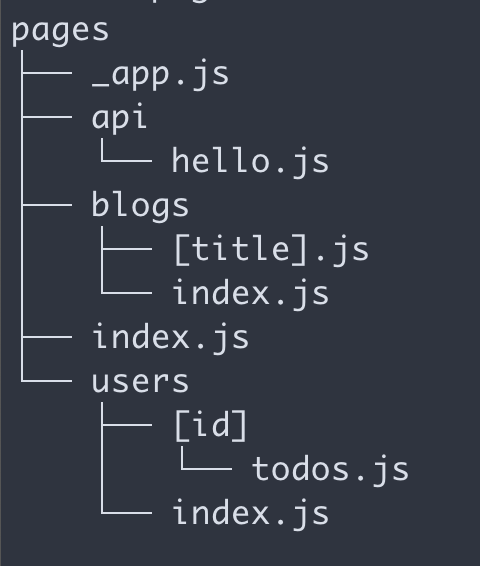
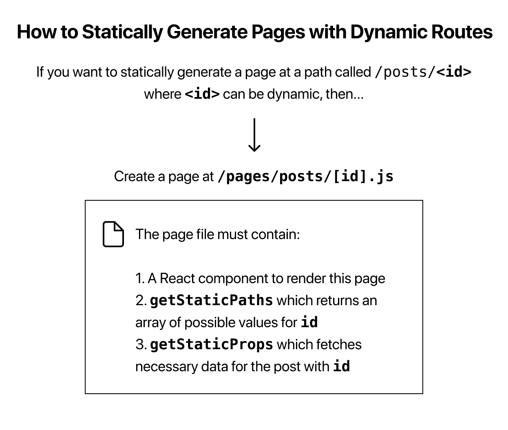
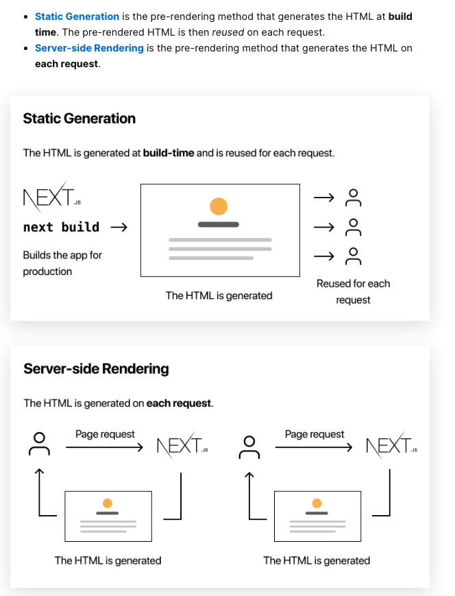
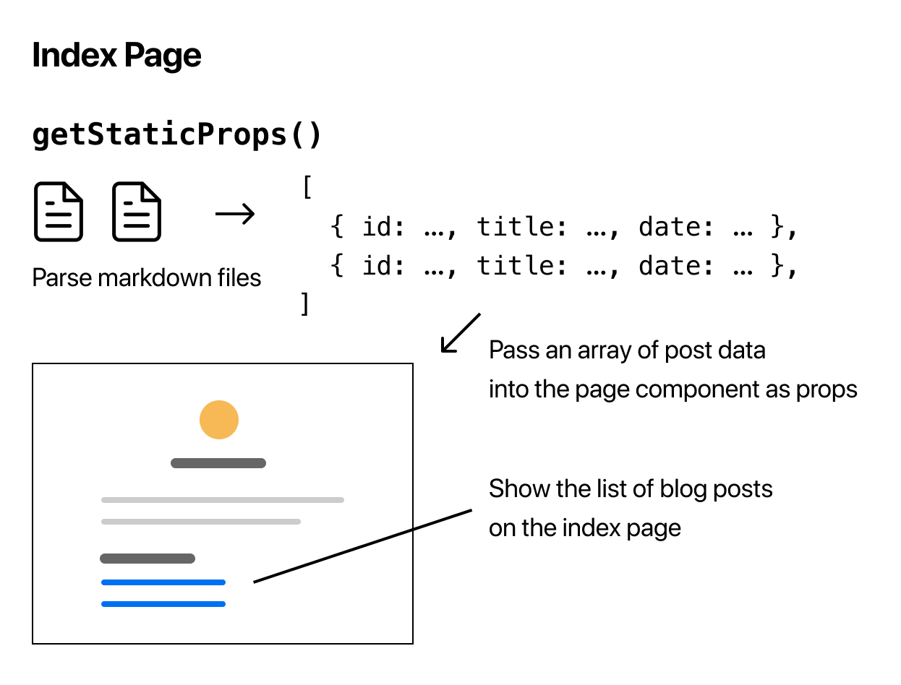
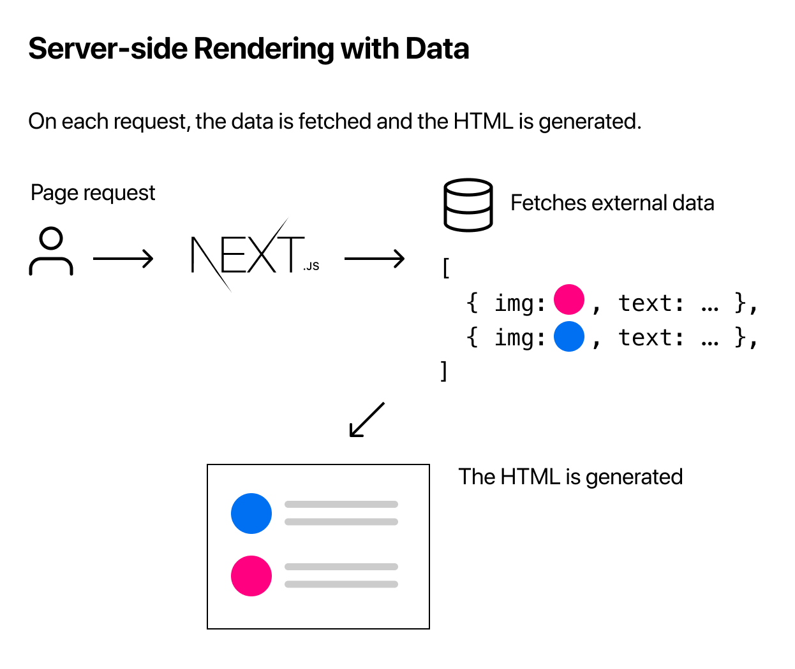
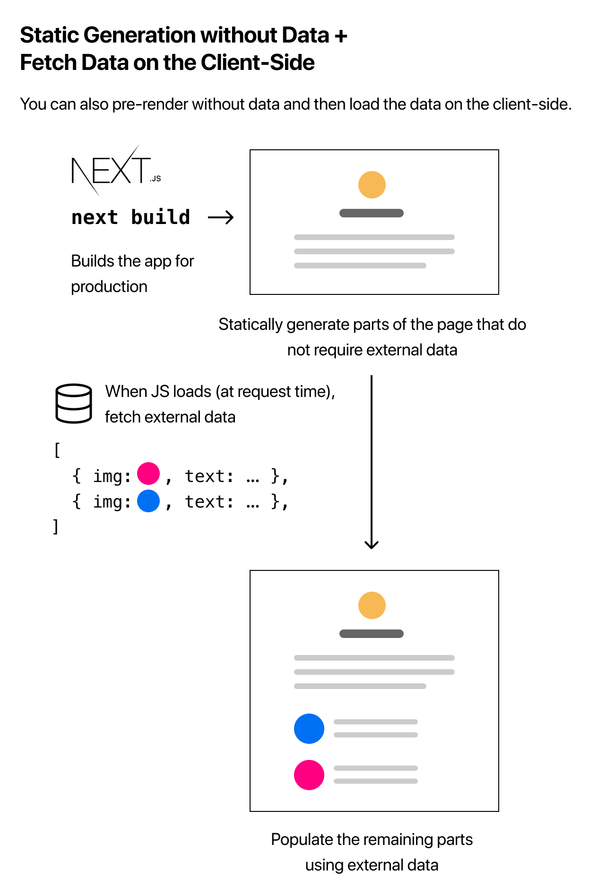

# Next.js Assessment


Currently, we are facing a few issues in our client-rendered applications that may be resolved through server-side rendering. So, over the past few days, I've experimented with Next.js to see if it's a viable option for our team. My aim was to determine the level of effort involved with moving to Next/SSR and evaluate the viability.


## Pros & Cons 

The official Next tutorial is an excellent introduction. In addition to my own notes, I've included images, highlights, and code snippets that seemed useful. All of this can be found below. 

Before jumping into the notes, I want to highlight some key takeaways. 

The conventions around Next are pretty straight-forward and it's very easy to get up and running. However, like most frameworks, once you travel off the beaten path, things can become difficult. 

### Setup & Config

Setting up Redux & Sagas proved to be very difficult. Primarily due to recommended libraries being deprecated or out of sync with the official Next.js recommendations. 
This issue led to having to rely primarily on examples in the source code, with a largely trial & error approach to setup & configuration. 

Thankfully, once the initial setup and confusion was out of the way, our existing patterns were fairly easy to implement. 

While this is a concern, having a reliable set of team-oriented documentation and best-practices should mitigate many of the issues I encountered. 

### Initial Takeaway

It seemed like daily my opinion changed on whether or not Next.js is the right fit. And if I'm being completely honest, I'm still not sure.

There are many benefits to having a reliable production focused framework powering our application. However, the learning curve was a little steeper than I anticipated. 

Will this address our current and future needs? I believe so.  
However, if we move forward, I would advise doing so with patience and caution. 


Now, on to the fun stuff 🎉

---


## Create Next App
Next has a very nice Create-React-App (CRA) like CLI that scaffolds an app. In many ways, this tool is more robust than CRA. 

In addition you can use any of the [examples](https://github.com/vercel/next.js/tree/canary/examples) to spin up a fully functioning example app. 

```shell
$ yarn create next-app --example with-redux
```

---

## Routing & Pages

Routing with Next couldn't be easier as the routing is primarily **file based**, meaning: 

> Pages are associated with a route based on their file name. For example, in development:
>	- `pages/index.js` is associated with the `/` route.
>	- `pages/posts/first-post.js` is associated with the `/posts/first-post` route.


This method has a few quirks, but once you become accustomed, it's pretty easy to find an approach that works. 


### Nested & Dynamic Routes

> Next.js allows you to statically generate pages with paths that depend on external data. This enables dynamic URLs in Next.js

Nested routes work as you would expect. However the naming convention is slightly different. In the example application you'll see the following file structure: 




You'll notice an unusual _bracket_ syntax under `blogs` and `users`: `/blogs/[title].js` & `/users/[id]/todos.js`

This syntax allows for dynamic values to be utilized for various components. The brackets represent the value (ex: user ID, blog title, etc.)

_note: the bracket syntax can be used for files or directories_




#### Steps: 
_note: `getStaticPaths` & `getStaticProps` will be covered later in this document._

>- Create a file in `pages/post` directory named `[id].js`[]
  *Pages that begin with [ and end with ] are dynamic routes in Next.js.*
>- `export` an `async` function named `getStaticPaths` from this page. 
  *In this function... return a list of possible values for ID**
>- Finally...implement `getStaticProps` again - this time, to fetch necessary data for the blog post with a given id


--- 

## Walkthrough

While Next.js has quite a few awesome features like internal API routes and direct interactions with a DB, our scope will be limited working with data fetched from a separate API. 

Ultimately, this prototype seeks to mimic our current application structure and configuration. 

It's worth noting that usage with redux-saga is still a work in progress. The existing libraries have been deprecated, so much of this prototype's structure relies on information derived from studying the source code found in the Vercel/Next.js examples directory. 


### Initial Setup

Our setup requires configuration of the store which can be found in `store/index.js`


*the highlights*
```javascript
import { applyMiddleware, createStore } from 'redux';
import { createWrapper } from 'next-redux-wrapper';
// additional imports


const bindMiddleware = (middleware) => {
  // redux devtool config
  return applyMiddleware(...middleware);
};

// create a makeStore function, and pass in middleware
export const makeStore = (context) => {
  const sagaMiddleware = createSagaMiddleware();
  const store = createStore(rootReducer, bindMiddleware([sagaMiddleware]));

  store.sagaTask = sagaMiddleware.run(rootSaga);

  return store;
};

// export an assembled wrapper
export const wrapper = createWrapper(makeStore, { debug: true });

```


1. `bindMiddleware`- sets up store to work with sagas and any other middleware
2. `makeStore` - creates an instance of the store
	1. setup saga middleware
	2. create instance of store
	3. `store.sagaTask` - create a mechanism for running our sagas when the appropriate actions are dispatched (we'll see this in use later on)
3. `createWrapper` uses the [next-redux-wrapper](https://github.com/kirill-konshin/next-redux-wrapper) library to create a Higher Order Component (HOC) for use throughout our application. 

### Hydration

You'll notice in each reducer we first check to determine if the `HYDRATE` action has been dispatched. 

The [NRW Docs](https://github.com/kirill-konshin/next-redux-wrapper#state-reconciliation-during-hydration) talk about this in more depth. 

However, for our purposes, the major point is this action is dispatched/invoked whenever a ser navigates to a page calling for props at build time or directly from the server. 

This can cause reconciliation issues when navigating to nested components as your state could accidentally be erased. To avoid this, we'll do the following: 


```javascript
const initialState = {
  data: [],
  error: null,
  isFetching: false,
};

const usersReducer = (state = initialState, action) => {
  switch (action.type) {
    case HYDRATE:
      const nextState = {
        ...state, // use previous state
        ...action.payload, // apply delta from hydration
      };
      if (state.data.length) {
        nextState.data = state.data;
        return nextState;
      }
    
	// normal actions...
	
    default:
      return state;
  }
};
```

*When the `HYDRATE` action is dispatched*
1. create a `nextState` object
2. use previous state and pass in any data from the action's payload
3. _if_ the state already had data
	1. Apply existing state to new state (as it will otherwise likely be erased)
	2. return the new state object

_note: there are probably more elegant ways to accomplish this_

---


## Pre-rendering & Data Fetching

Before diving further into the code, we'll need to understand how Next handles fetching and rendering data. 

Next offers two main options for pre-rendering: 

- Static Genration via `getStaticProps` 
- Server Side Rendering via `getServerSideProps`



*This application demonstrates both options and will be noted accordingly.*

--- 

### getStaticProps

As indicated above, `getStaticProps` is called at build time and can be used to statically generate many types of pages, including:

- Blog posts
- E-commerce product listings
- Marketing material
- Help and documentation

As the docs indicate: 

> You should ask yourself: "Can I pre-render this page ahead of a user's request?" If the answer is yes, then you should choose Static Generation.


#### Static Generation with Data

Obvi, you can generate static HTML, but, you can also fetch other types of data (json, markdown, etc) at build time using [https://nextjs.org/docs/basic-features/pages#static-generation-with-data](https://nextjs.org/docs/basic-features/pages#static-generation-with-data)


```javascript

export default function Home(props) { ... }

export async function getStaticProps() {
  // Get external data from the file system, API, DB, etc.
  const data = ...

  // The value of the `props` key will be
  //  passed to the `Home` component
  return {
    props: ...
  }
}
```

The docs go on to state: 

> Essentially, `getStaticProps` allows you to tell Next.js: “Hey, this page has some data dependencies — so when you pre-render this page at build time, make sure to resolve them first!”

*An example of how markdown can be consumed* 




_you can also import data directly from API calls_

```javascript
// fetch example

import fetch from 'node-fetch'

export async function getSortedPostsData() {
  // Instead of the file system,
  // fetch post data from an external API endpoint
  const res = await fetch('..')
  return res.json()
}
```


_and, query the DB directly_

```javascript
import someDatabaseSDK from 'someDatabaseSDK'

const databaseClient = someDatabaseSDK.createClient(...)

export async function getSortedPostsData() {
  // Instead of the file system,
  // fetch post data from a database
  return databaseClient.query('SELECT posts...')
}
```

> This is possible because getStaticProps runs only on the server-side. It will never run on the client-side. It won’t even be included in the JS bundle for the browser. That means you can write code such as direct database queries without them being sent to browsers.


#### Caveats to Static Generation

There are a few items to note when working with static generation

`getStaticProps` ***can only be exported from a page***. You can’t export it from non-page files.

**One of the reasons for this restriction is that React needs to have all the required data before the page is rendered.**

_note: Because it’s meant to be run at build time, you won’t be able to use data that’s only available during request time, such as query parameters or HTTP headers._


> Static Generation is not a good idea if you cannot pre-render a page ahead of a user's request. Maybe your page shows frequently updated data, and the page content changes on every request.


### getServerSideProps

We can easily fetch data upon each request with the `getServerSideProps` method. This behaves quite similar to a traditional fetch request inside of `useEffect`.  With the major exception being that the data is rendered on the server. 

According to the docs: 

> You should use `getServerSideProps` *only* if you need to pre-render a page whose data must be fetched at request time. 




#### usage

The docs also state:

> To use Server-side Rendering, you need to export `getServerSideProps` instead of` getStaticProps` from your page.

*example:*
```javascript
export async function getServerSideProps(context) {
  return {
    props: {
      // props for your component
    }
  }
}
```

----

#### Context

`getServersideProps` also accepts a `context` object containing the following values: 
- params
- request
- response
- query 
- preview
- previewData
- resolvedURL 

to learn more about these values check out: [https://nextjs.org/docs/basic-features/data-fetching#getserversideprops-server-side-rendering](https://nextjs.org/docs/basic-features/data-fetching#getserversideprops-server-side-rendering)


## Users

For Users we will assume the data rarely changes and we can generate the data at _build-time_. This allows the use of `getStaticProps`. However, unlike the example above, we need to make a special exception for usage with our redux-saga configuration. 

Navigating to `/pages/users` locate the `getStaticProps` function (on or around line 33).


```javascript
// assign next-redux-wrapper's `getStaticProps` to a local `async` function
// this will be exported and called at build-time by Next.js
// note: the `store` argument will be supplied when the callback is invoked
export const getStaticProps = wrapper.getStaticProps(async ({ store }) => {
  // only run this function if there is no user data in the store
  if (!store.getState().users.data?.length) {
    // dispatch the `fetchUsers` action { type: FETCH_USERS }
    store.dispatch(fetchUsers());

    // cancel any outstanding tasks
    store.dispatch(END);

    // convert sagaTask (sagaMiddleware.run) to a promise and await result
    await store.sagaTask.toPromise();
  }
});
```

- Export an `async` function named `getStaticProps` 
	- In our case, we need to use the method provided by [next-redux-wrapper](https://github.com/kirill-konshin/next-redux-wrapper)_
	- The `store` argument is provided by `next-redux-wrapper` when invoked
- Use the `store`'s  `getState` function to determine if user data is already present
- dispatch our `fetchUsers` action, which will initiate the appropriate saga
- dispatch a signal to end all outstanding tasks
- convert sagaTask (found in the `makeStore` function in `/store/index.js`) to a promise and `await` result


---

## Additional Info

See below, for a few more nice-to-know attributes of Next.js

### Client Side Rendering

If you don't need to pre-render data, you can always fall back to client-side-rendering, or even mix & match your approach depending on the needs.



---

### SWR
One other thing worth checking out is the [SWR](https://swr.vercel.app/) (stale-while-revalidate) hook made by the next/vercel team. 

This hook serves up cached data while fetching new data behind the scenes. 

----

### Fetch External API or Query Database

> Like `getStaticProps`, `getStaticPaths` can fetch data from any data source...

```javascript
export async function getAllPostIds() {
  // Instead of the file system,
  // fetch post data from an external API endpoint
  const res = await fetch('..')
  const posts = await res.json()
  return posts.map(post => {
    return {
      params: {
        id: post.id
      }
    }
  })
}
```

#### Fallback

`getStaticPaths` has a `fallback` attribute

> If `fallback` is `false`, then any paths not returned by `getStaticPaths` will result in a `404` page.

> If `fallback` is `true`, then the behavior of `getStaticProps` changes:

> - The paths returned from `getStaticPaths` will be rendered to HTML at build time.
> - The paths that have not been generated at build time will not result in a `404` page. Instead, Next.js will serve a “fallback” version of the page on the first request to such a path.
> - In the background, Next.js will statically generate the requested path. Subsequent requests to the same path will serve the generated page, just like other pages pre-rendered at build time.


